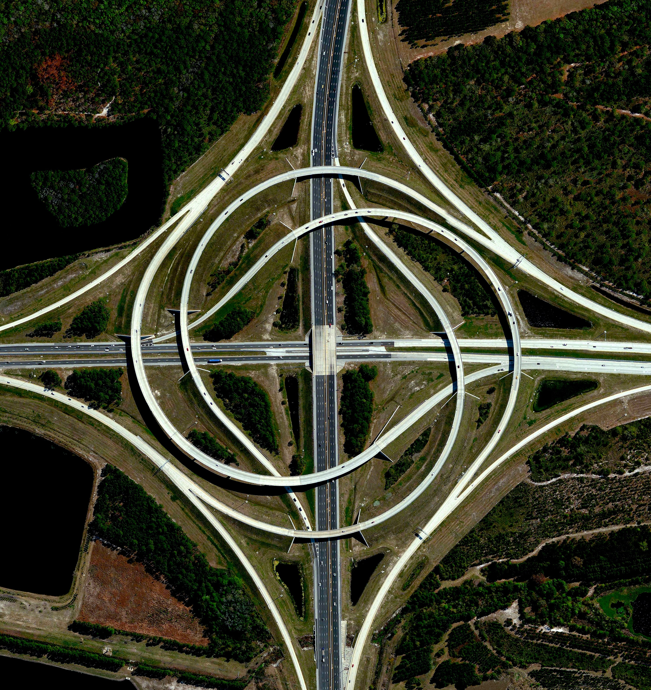
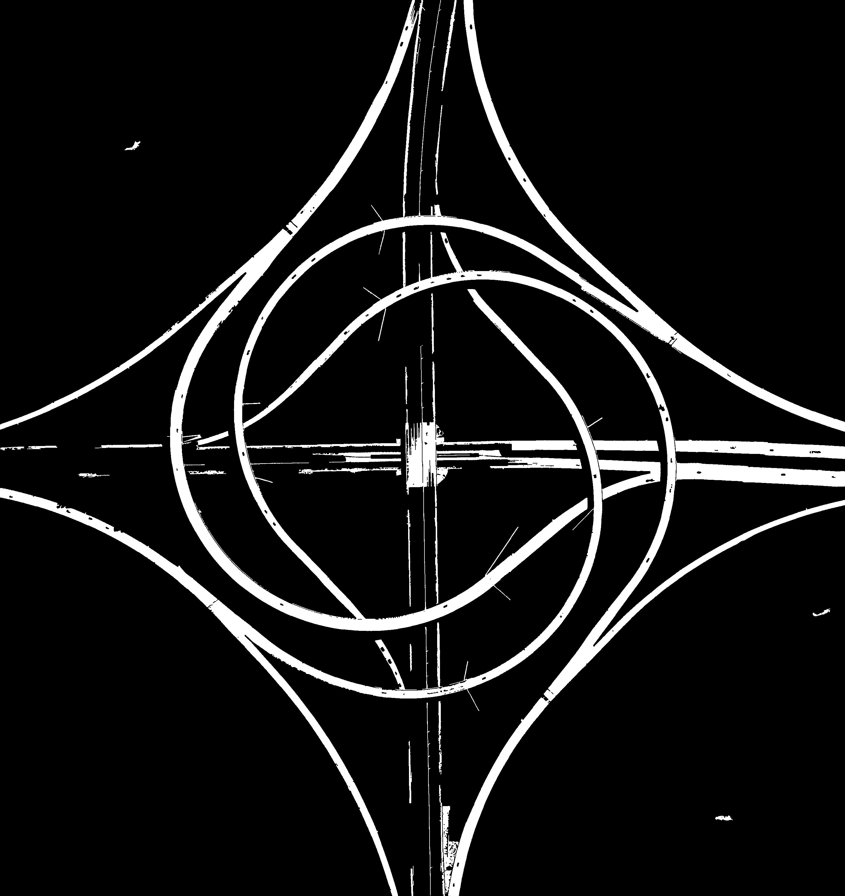
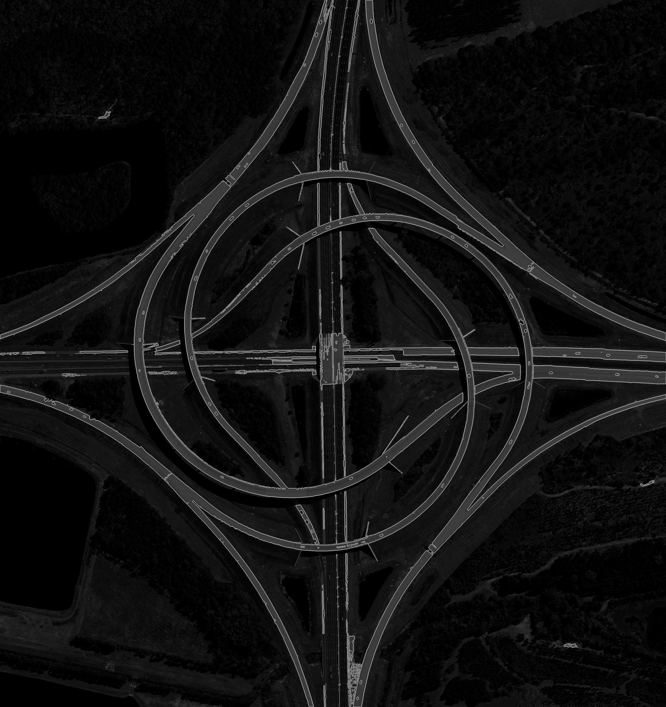

# Road Extraction from Satellite Images

 

|  |  |  |
|:------------:|:-------------:|:-------------:|
| **Input** | **Extracted Image** | **Overlayed Image** |

    

## Required Matlab Toolbox:
- Image Processing Toolbox
- Computer Vision Toolbox
